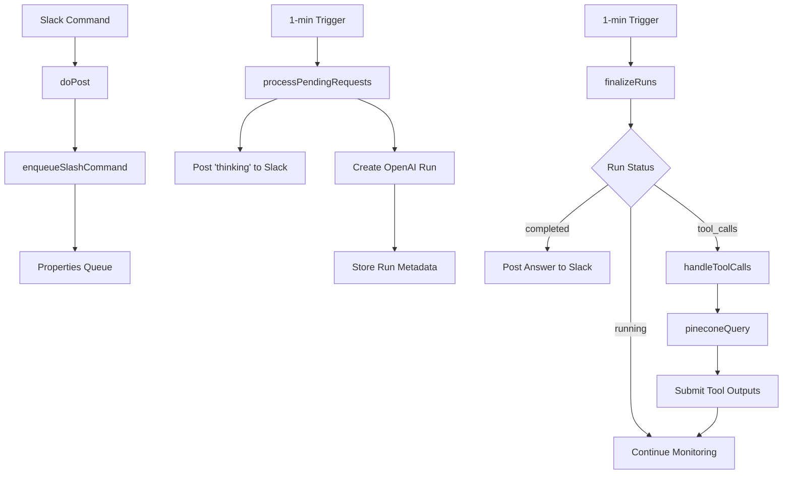

# API Documentation

This document describes the internal APIs and functions used in the Mula Slack Assistant.

## Overview

The Mula Slack Assistant consists of several key components that work together to provide intelligent email search capabilities through Slack.

## Core Functions

### Webhook Endpoints

#### `doGet(e)`
Health check endpoint for the deployed web app.

**Purpose:** Provides a simple health check for monitoring and verification.

**Request:** `GET /`

**Response:** 
```
Status: 200 OK
Content-Type: text/plain
Body: "ok"
```

**Usage:**
```bash
curl https://script.google.com/macros/s/YOUR_DEPLOYMENT_ID/exec
```

#### `doPost(e)`
Main webhook endpoint that receives Slack slash commands.

**Purpose:** Receives and enqueues Slack slash command requests for asynchronous processing.

**Request Format:**
```json
{
  "command": "/mula",
  "text": "What's the latest from Brit+Co?",
  "channel_id": "C1234567890",
  "user_id": "U1234567890",
  "team_id": "T1234567890"
}
```

**Response:**
```
Status: 200 OK
Content-Type: text/plain
Body: "ok"
```

**Process:**
1. Parses incoming Slack webhook data
2. Extracts relevant information (text, channel, user)
3. Enqueues request for background processing
4. Returns immediate acknowledgment to Slack

### Queue Management

#### `enqueueSlashCommand(obj)`
Adds a slash command request to the processing queue.

**Parameters:**
- `obj` (Object): Request object containing:
  ```javascript
  {
    text: string,      // User's query
    channelId: string, // Slack channel ID
    userId: string,    // Slack user ID
    timestamp: number  // Request timestamp
  }
  ```

**Storage:** Uses Google Apps Script Properties Service with key `SLASH_QUEUE`.

#### `processPendingRequests()`
Processes queued slash command requests (triggered every minute).

**Purpose:**
1. Retrieves queued requests from properties
2. Posts "thinking" message to Slack
3. Initiates OpenAI assistant run
4. Stores run metadata for tracking

**Trigger:** Time-based trigger (1 minute intervals)

### Assistant Management

#### `queueAssistantRun(text, channelId, threadTs)`
Creates and starts an OpenAI assistant run.

**Parameters:**
- `text` (string): User's query
- `channelId` (string): Slack channel ID
- `threadTs` (string): Slack message timestamp

**Process:**
1. Gets or creates OpenAI thread ID
2. Posts user message to thread
3. Starts assistant run
4. Stores run metadata

**Returns:** Nothing (throws on error)

#### `finalizeRuns()`
Monitors and completes active assistant runs (triggered every minute).

**Purpose:**
1. Checks status of active runs
2. Handles completed runs by posting results
3. Manages tool calls for Pinecone searches
4. Cleans up finished runs

**Trigger:** Time-based trigger (1 minute intervals)

### OpenAI Integration

#### `Api` Object
Wrapper for OpenAI API calls.

##### `Api.get(path)`
**Parameters:**
- `path` (string): API endpoint path (e.g., `/threads/thread_id/messages`)

**Returns:** String response from OpenAI API

**Headers:**
```javascript
{
  "Authorization": "Bearer sk-proj-...",
  "OpenAI-Beta": "assistants=v2"
}
```

##### `Api.post(path, body)`
**Parameters:**
- `path` (string): API endpoint path
- `body` (Object): Request payload

**Returns:** String response from OpenAI API

#### Thread Management

##### `getOrCreateThreadId(channelId, threadTs)`
Gets existing or creates new OpenAI thread for a Slack conversation.

**Parameters:**
- `channelId` (string): Slack channel ID
- `threadTs` (string): Slack message timestamp

**Returns:** String thread ID

**Caching:** Uses Google Apps Script Cache Service (6-hour TTL)

##### `postMessageToThread(threadId, role, content)`
Adds a message to an OpenAI thread.

**Parameters:**
- `threadId` (string): OpenAI thread ID
- `role` (string): Message role ("user" or "assistant")
- `content` (string): Message content

##### `lastAssistantMessage(threadId)`
Retrieves the most recent assistant message from a thread.

**Parameters:**
- `threadId` (string): OpenAI thread ID

**Returns:** String content of last assistant message

### Tool Calls & Pinecone Integration

#### `handleToolCalls(threadId, runId)`
Processes OpenAI assistant tool calls for email search.

**Parameters:**
- `threadId` (string): OpenAI thread ID
- `runId` (string): OpenAI run ID

**Process:**
1. Fetches run details from OpenAI
2. Extracts tool call requirements
3. Executes Pinecone queries
4. Submits results back to OpenAI

#### `pineconeQuery(q)`
Performs semantic search against Pinecone vector database.

**Parameters:**
- `q` (string): Search query

**Returns:** Array of search results:
```javascript
[
  {
    id: "email_123",
    text: "Email content snippet...",
    timestamp: "2025-06-15T10:30:00Z"
  }
]
```

**Process:**
1. Creates embedding using OpenAI's `text-embedding-3-small`
2. Queries Pinecone with vector
3. Returns top 5 matches with metadata

### Slack Integration

#### `postToSlack(channel, thread_ts, text, edit = false)`
Posts or updates messages in Slack.

**Parameters:**
- `channel` (string): Slack channel ID
- `thread_ts` (string): Message timestamp (null for new messages)
- `text` (string): Message content
- `edit` (boolean): Whether to update existing message

**Returns:** String message timestamp

**APIs Used:**
- `chat.postMessage` (for new messages)
- `chat.update` (for edits)

### Assistant Creation

#### `createAssistantWithSearchTool()`
Creates the OpenAI assistant with email search capabilities (run once).

**Configuration:**
```javascript
{
  name: "Account-Summary-Assistant",
  model: "gpt-4o-mini",
  description: "Fetches publisher context from Pinecone-indexed emails",
  tools: [{
    type: "function",
    function: {
      name: "search_emails",
      description: "Search email archive",
      parameters: {
        type: "object",
        properties: {
          query: {
            type: "string",
            description: "Search keywords"
          }
        },
        required: ["query"]
      }
    }
  }]
}
```

**Instructions:** Detailed system prompt for consistent response formatting.

### Run Tracking

#### `storeRun(id, obj)`
Stores metadata for an active assistant run.

**Parameters:**
- `id` (string): OpenAI run ID
- `obj` (Object): Metadata object:
  ```javascript
  {
    channelId: string,
    ts: string,
    threadId: string,
    cycles: number
  }
  ```

**Storage:** Uses Properties Service with keys:
- `ACTIVE_RUNS`: Array of active run IDs
- `RUN_META_{runId}`: Individual run metadata

### Trigger Management

#### `installProcessPendingRequestsTrigger()`
Creates time-based trigger for processing queued requests.

**Configuration:**
- Function: `processPendingRequests`
- Frequency: Every 1 minute
- Type: Time-based

#### `installFinalizeTrigger()`
Creates time-based trigger for monitoring assistant runs.

**Configuration:**
- Function: `finalizeRuns`
- Frequency: Every 1 minute
- Type: Time-based

## Data Flow



## Error Handling

### Standard Error Response
All functions use try-catch blocks with detailed logging:

```javascript
try {
  // Operation
} catch (err) {
  Logger.log('[Error] Function failed: ' + err.message);
  throw new Error('Descriptive error message: ' + err.message);
}
```

### Error Types

1. **API Errors**: OpenAI, Slack, or Pinecone API failures
2. **Authentication Errors**: Invalid API keys or tokens
3. **Data Errors**: Malformed JSON or missing properties
4. **Timeout Errors**: Long-running operations (handled by queue system)

## Rate Limiting

### Built-in Protections
- Queue-based processing prevents API overload
- 1-minute trigger intervals limit request frequency
- Error handling prevents infinite retry loops

### Recommended Limits
- OpenAI API: Respect tier limits (varies by plan)
- Slack API: ~1 message per second per channel
- Pinecone: Varies by plan and index size

## Configuration

### Required Properties
All configuration stored in Google Apps Script Properties:

| Property | Format | Description |
|----------|--------|-------------|
| `SLACK_BOT_TOKEN` | `xoxb-...` | Slack Bot OAuth Token |
| `SLACK_SIGNING_SECRET` | hex string | Slack signing secret (optional) |
| `OPENAI_KEY` | `sk-proj-...` | OpenAI API key |
| `OPENAI_ASST` | `asst_...` | Assistant ID (created automatically) |
| `PINECONE_ENDPOINT` | URL | Pinecone index endpoint |
| `PINECONE_KEY` | `pcsk-...` | Pinecone API key |

### Runtime Properties
Temporary storage for active operations:

| Property | Type | Description |
|----------|------|-------------|
| `SLASH_QUEUE` | JSON Array | Pending slash commands |
| `ACTIVE_RUNS` | JSON Array | Active OpenAI run IDs |
| `RUN_META_{id}` | JSON Object | Run metadata |

## Security

### API Key Storage
- All sensitive keys stored in Google Apps Script Properties
- Never logged or exposed in execution transcripts
- Encrypted at rest by Google

### Request Validation
- Slack signature verification supported (optional)
- All external API calls use proper authentication
- Input validation for all user queries

### Access Control
- Web app deployment controls access ("Anyone" for Slack webhooks)
- Google Apps Script execution permissions
- Individual API service authentication

---

For implementation details, see the main [Code.gs](../Code.gs) file.
For setup instructions, see the [setup guide](setup.md). 